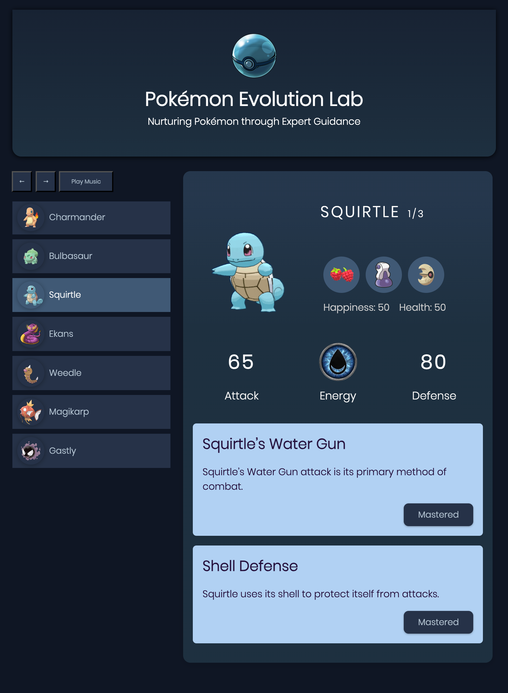

<table style="width: 100%; border-collapse: collapse;">
  <tr>
    <!-- Left cell: Text content -->
    <td style="width: 60%; padding-right: 2rem; vertical-align: top;">
      <h2>Pokémon Evolution Lab</h2>
      
Pokémon Evolution Lab is an Angular web app where you can care for and level up your Pokémon.

      <h3>Features</h3>
      <ul>
        <li><strong>Learning Task</strong>: Track and complete learning tasks for each Pokémon stage, focusing on their skills, behaviors, and care routines.</li>
        <li><strong>Three-Stage Task System</strong>: Each Pokémon has three sets of learning tasks—one for each evolution stage. Complete all tasks to unlock their full potential.</li>
        <li><strong>Health and Happiness System</strong>: Keep an eye on your Pokémon's health and happiness. Their evolution depends on achieving key milestones while completing tasks.</li>
        <li><strong>Pokémon Evolution</strong>:
          <ul>
            <li><strong>Second Evolution</strong>: Evolution occurs once all learning tasks are completed, and the Pokémon's health and happiness exceed 1000.</li>
            <li><strong>Third Evolution</strong>: Evolution occurs once all second-stage learning tasks are completed and the Pokémon's health and happiness exceed 2000.</li>
          </ul>
        </li>
        <li><strong>Responsive Design</strong></li>
      </ul>

      <h3>Technologies Used</h3>
      <ul>
        <li><strong>Angular</strong></li>
        <li><strong>TypeScript</strong></li>
        <li><strong>CSS</strong></li>
        <li><strong>HTML</strong></li>
      </ul>

      
Author: Tal Argaman.

    </td>

    <!-- Right cell: Image -->
    <td style="width: 40%; text-align: center; vertical-align: top;">
      
    </td>
  </tr>
</table>
