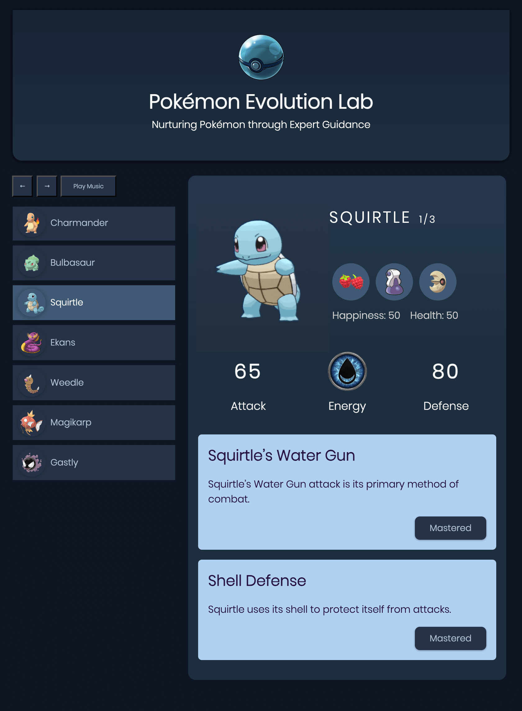

## Pokémon Evolution Lab

Pokémon Evolution Lab is an Angular web app where you can care for and level up your Pokémon.

---

**Features:**

- **Learning Task**: Track and complete learning tasks for each Pokémon stage, focusing on their skills, behaviors, and care routines.

- **Three-Stage Task System**: Each Pokémon has three sets of learning tasks—one for each evolution stage. Complete all tasks to unlock their full potential.

- **Health and Happiness System**: Keep an eye on your Pokémon's health & happiness. Their evolution depends on achieving key milestones while completing tasks.

**Pokémon Evolution:**

- **First Evolution**: Occurs once all learning tasks are completed, and Pokémon's health & happiness exceed 1000.
  
- **Second Evolution**: Occurs once all second-stage learning tasks are completed and Pokémon's health & happiness exceed 2000.

- **Full Potential:** Occurs once all third-stage learning tasks are completed and its health & happiness hit 2500.

---

**Technologies:**

- **Angular17**
- **TypeScript**
- **CSS3**
- **HTML5**

---

**Author:** Tal Argaman
